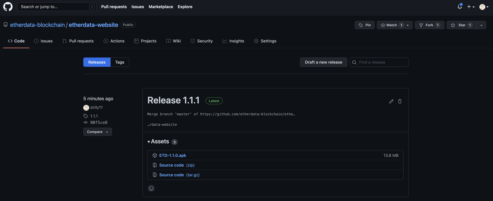
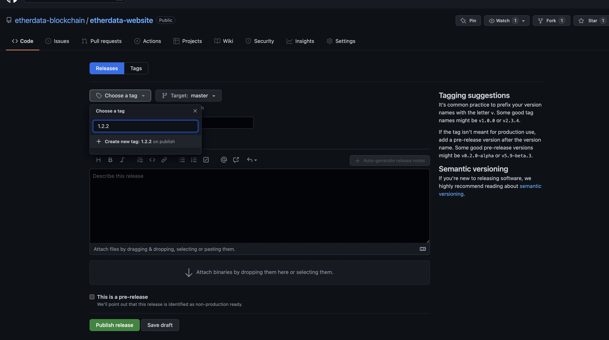

# 发布新版本方法

1. 打开[Release](https://github.com/etherdata-blockchain/etherdata-website/releases)

找到Draft a new release 按钮

2. 创建新的Release

在choose a tag 部分输入新的版本号， 点击创建新的tag，之后在attach binaries部分上传ios和安卓的安装包，之后点击发布即可。之后
系统会自动生成新的网页，因此不需要对网页作任何修改。